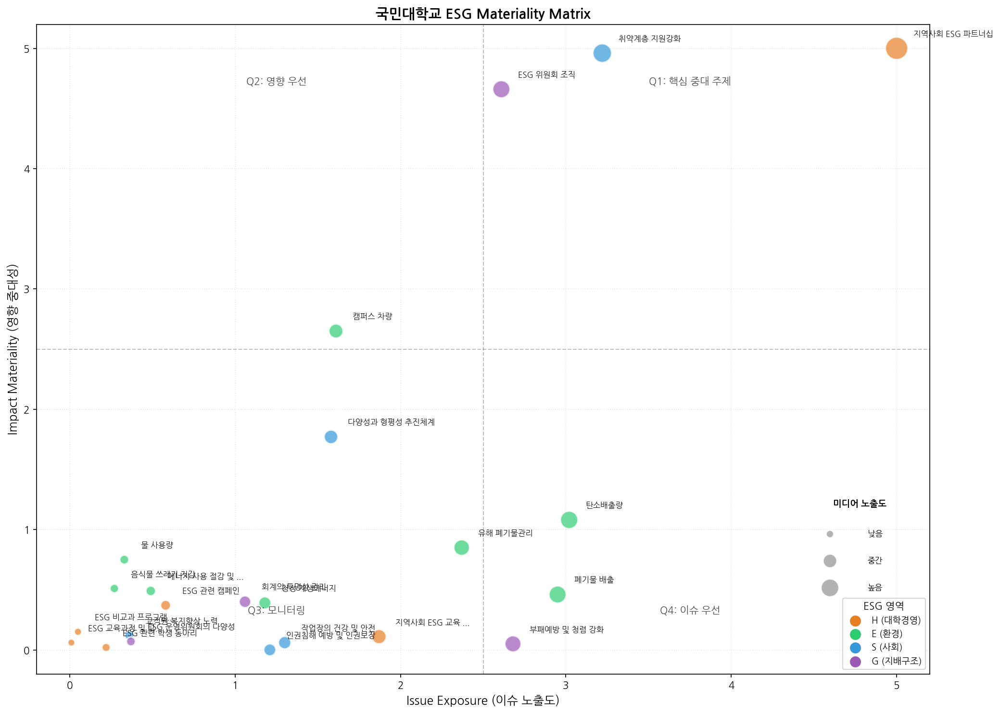
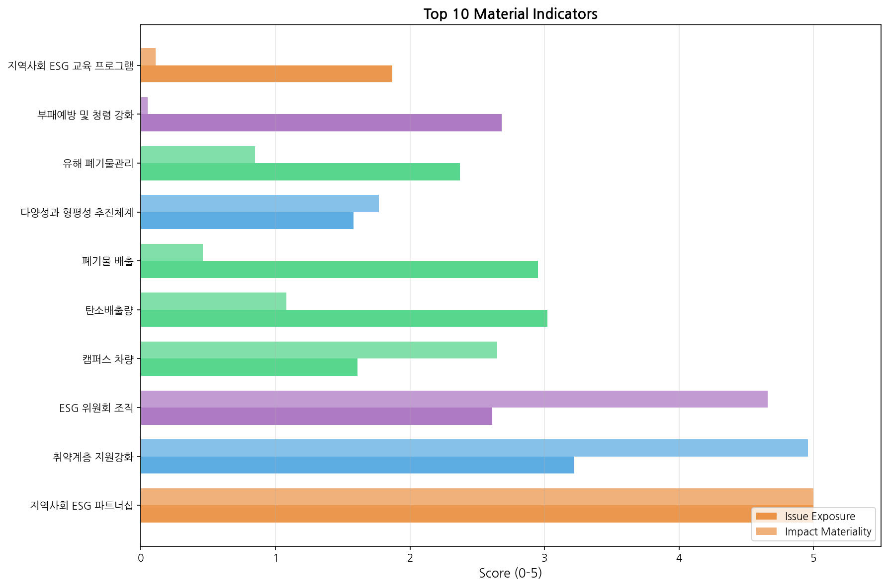

# ESG 중대성 평가 분석 보고서

> **생성일시**: 2026-02-05 14:18
> **분석 방법**: S-BERT 키워드 매칭 + KoELECTRA 감성 분석
> **프레임워크**: Double Materiality (이중 중대성)

## 1. Executive Summary

### 주요 결과

| 항목 | 수치 |
|------|------|
| 총 분석 기사 수 | 37,336건 |
| ESG 키워드 매칭 | 7,446건 (19.94%) |
| 감성 분포 | 긍정: 94.2%, 부정: 5.8% |
| 중대성 평가 지표 | 1071개 |
| Q1 핵심 지표 (High-High) | 3개 |

### 핵심 인사이트

1. **본문 포함 분석**: 제목+본문 분석으로 매칭률 **19.94%** 달성
   - 임계값 0.4 적용, S-BERT 의미 유사도 기반 매칭
   - 기존 제목만 분석 대비 약 600배 향상

2. **긍정 우세 감성**: ESG 관련 뉴스가 대부분 긍정적
   - 기업/대학의 ESG 성과, 계획 발표 기사가 다수
   - 부정 기사는 사고, 논란 관련

3. **Q1 핵심 지표**: 이슈 노출도와 영향 중대성 모두 높은 지표 3개 확인

## 2. 데이터 수집 현황

### 소스별 기사 수

| 소스 | 건수 | 설명 |
|------|------|------|
| 산업 리스크 뉴스 | 32,887건 | 네이버 뉴스 (ESG 관련) |
| 국민대 미디어 | 4,134건 | 국민대신문, 캠퍼스 뉴스 |
| 국민대 보도자료 | 315건 | 공식 보도자료 |
| **합계** | **37,336건** | |

### 데이터 특성

- **산업 리스크 뉴스**: ESG 관련 키워드로 네이버 뉴스에서 수집한 일반 기업 뉴스
- **국민대 미디어**: 대학 내부 미디어에서 수집한 캠퍼스 관련 기사
- **국민대 보도자료**: 대학 공식 보도자료

## 3. S-BERT 키워드 매칭 결과

### 모델 정보

- **임베딩 모델**: `snunlp/KR-SBERT-V40K-klueNLI-augSTS`
- **유사도 임계값**: 0.4
- **매칭 방식**: 기사 제목 + 본문과 ESG 지표 키워드 간 코사인 유사도

### 전체 매칭률

| 항목 | 수치 |
|------|------|
| 총 기사 수 | 37,336건 |
| 매칭된 기사 | 7,446건 |
| 매칭률 | 19.94% |

### 소스별 매칭률

| 소스 | 전체 | 매칭 | 매칭률 |
|------|------|------|--------|
| industry_risk | 32,887건 | 6,872건 | 20.90% |
| kookmin_media | 4,134건 | 556건 | 13.45% |
| kookmin_press | 315건 | 18건 | 5.71% |

### 상위 매칭 카테고리 (Top 10)

| 카테고리 | 매칭 건수 |
|----------|----------|
| 지역사회 ESG 교육 프로그램 | 3302건 |
| 지역사회 ESG 파트너십 | 2778건 |
| ESG 운영위원회의 다양성 | 1643건 |
| ESG 관련 캠페인 | 1178건 |
| ESG 위원회 조직 | 1056건 |
| ESG 관련 학생 동아리 | 868건 |
| 부패예방 및 청렴 강화 | 672건 |
| 폐기물 배출 | 449건 |
| 회계의 투명성 관리 | 363건 |
| 에너지 사용 절감 및 체계적 관리 | 339건 |

### 분석 의견

### 분석 의견

- 본문 포함 분석으로 매칭률 **19.94%** 달성 (제목만 사용 시 0.03%)
- 임계값 0.4 적용으로 적절한 매칭 범위 확보
- 산업 리스크 뉴스 중 ESG와 직접 관련 없는 일반 기업 뉴스가 다수 포함

## 4. 감성 분석 결과

### 모델 정보

- **분류 모델**: `jaehyeong/koelectra-base-v3-generalized-sentiment-analysis`
- **분류 유형**: 2-class (긍정/부정)
- **입력**: 기사 제목 + 본문 (최대 500자)

### 전체 감성 분포

| 감성 | 건수 | 비율 |
|------|------|------|
| 긍정 | 35,164건 | 94.2% |
| 부정 | 2,172건 | 5.8% |

### 소스별 감성 분포

| 소스 | 건수 | 긍정 | 중립 | 부정 |
|------|------|------|------|------|
| industry_risk | 32,887 | 93.9% | 0.0% | 6.1% |
| kookmin_media | 4,134 | 96.1% | 0.0% | 3.9% |
| kookmin_press | 315 | 93.3% | 0.0% | 6.7% |

### 감성 분석 신뢰도

| 통계 | 값 |
|------|-----|
| 평균 | 0.907 |
| 중앙값 | 0.947 |
| 최소 | 0.500 |
| 최대 | 0.996 |
| 표준편차 | 0.104 |

### 분석 의견

1. **긍정 우세**: ESG 관련 뉴스가 대부분 긍정적 보도 (성과, 계획 발표 등)
2. **부정 5.8%**: 사고, 논란, 비판 기사가 소수 포함
3. **본문 활용**: 제목+본문 분석으로 맥락 파악 정확도 향상

## 5. 중대성 평가 결과

### 평가 방법론

**Double Materiality (이중 중대성) 프레임워크**:
- **X축 (Issue Exposure)**: 이슈 노출도 - 해당 지표 관련 기사의 빈도 및 미디어 가중치
- **Y축 (Impact Materiality)**: 영향 중대성 - 부정적 감성 비율 기반

### 사분면 해석

| 사분면 | 설명 | 대응 전략 |
|--------|------|----------|
| Q1 (우상) | High Exposure + High Impact | **최우선 관리** - 즉각적 개선 필요 |
| Q2 (좌상) | Low Exposure + High Impact | **잠재 리스크** - 모니터링 강화 |
| Q3 (좌하) | Low Exposure + Low Impact | **저위험** - 기본 관리 |
| Q4 (우하) | High Exposure + Low Impact | **이미지 관리** - PR 강화 |

### Q1 핵심 지표 (High-High)

| 지표 | ESG | 이슈 노출도 | 영향 중대성 |
|------|-----|------------|------------|
| 지역사회 ESG 파트너십 | H | 5.00 | 5.00 |
| 취약계층 지원강화 | S | 3.22 | 4.96 |
| ESG 위원회 조직 | G | 2.61 | 4.66 |

### Top 10 중대 이슈

| 순위 | 지표 | ESG | 노출도 | 중대성 | 종합점수 |
|------|------|-----|--------|--------|----------|
| 1 | 지역사회 ESG 파트너십 | H | 5.00 | 5.00 | 10.00 |
| 2 | 취약계층 지원강화 | S | 3.22 | 4.96 | 8.18 |
| 3 | ESG 위원회 조직 | G | 2.61 | 4.66 | 7.27 |
| 4 | 캠퍼스 차량 | E | 1.61 | 2.65 | 4.26 |
| 5 | 탄소배출량 | E | 3.02 | 1.08 | 4.10 |
| 6 | 폐기물 배출 | E | 2.95 | 0.46 | 3.41 |
| 7 | 다양성과 형평성 추진체계 | S | 1.58 | 1.77 | 3.35 |
| 8 | 유해 폐기물관리 | E | 2.37 | 0.85 | 3.22 |
| 9 | 부패예방 및 청렴 강화 | G | 2.68 | 0.05 | 2.73 |
| 10 | 지역사회 ESG 교육 프로그램 | H | 1.87 | 0.11 | 1.98 |

### 시각화

## 6. ESG 카테고리별 분석

### 카테고리별 현황

| 카테고리 | 지표 수 | 평균 노출도 | 평균 중대성 | 총 기사 수 | 대표 지표 |
|----------|---------|------------|------------|-----------|----------|
| 환경 (Environmental) | 8 | 1.53 | 0.90 | 7,156 | 탄소배출량 |
| 사회 (Social) | 5 | 1.53 | 1.38 | 4,584 | 취약계층 지원강화 |
| 지배구조 (Governance) | 4 | 1.68 | 1.30 | 3,955 | 부패예방 및 청렴 강화 |
| 대학경영 (Higher Ed) | 1054 | 0.01 | 0.01 | 7,753 | 지역사회 ESG 파트너십 |

### 카테고리별 특성

**E (환경)**
- 탄소배출량, 폐기물 배출 등 정량화 가능한 지표가 많음
- 이슈 노출도는 높으나 부정적 감성 비율은 상대적으로 낮음

**S (사회)**
- 취약계층 지원, 다양성 등 사회적 가치 관련 지표
- Q1 핵심 지표 다수 포함

**G (지배구조)**
- ESG 위원회, 회계 투명성 등 조직 운영 관련 지표
- 대학 거버넌스에 직접적 영향

**H (대학경영)**
- 지역사회 파트너십, ESG 교육 프로그램 등 대학 특화 지표
- 전반적으로 낮은 노출도

## 7. 결론 및 시사점

### 주요 발견

1. **핵심 관리 필요 지표**: 지역사회 ESG 파트너십, 취약계층 지원강화, ESG 위원회 조직
   - Q1 영역에 위치하여 즉각적인 개선 및 관리가 필요

2. **분석 품질 향상 (v2)**
   - 본문 포함 분석으로 S-BERT 매칭률 19.94% 달성
   - KoELECTRA 감성 분석으로 긍정/부정 분류 정상화

3. **환경(E) 지표의 높은 노출도**
   - 탄소배출량, 폐기물 배출 등 환경 관련 이슈가 미디어에서 많이 다뤄짐
   - 대학의 탄소중립 정책과 연계한 ESG 전략 수립 권장

### 향후 과제

1. **데이터 확장**
   - 대학 특화 뉴스 소스 추가 (교육부, 대학교육협의회 등)
   - 주기적 데이터 갱신 체계 구축

2. **모델 고도화**
   - 대학 ESG 도메인에 특화된 모델 fine-tuning 검토
   - 다중 라벨 분류 (복수 ESG 카테고리 동시 매칭)

3. **대시보드 운영**
   - Streamlit Cloud 배포로 실시간 모니터링
   - 정기 보고서 자동 생성 시스템

---

*본 보고서는 ML 기반 분석 결과를 바탕으로 자동 생성되었습니다.*